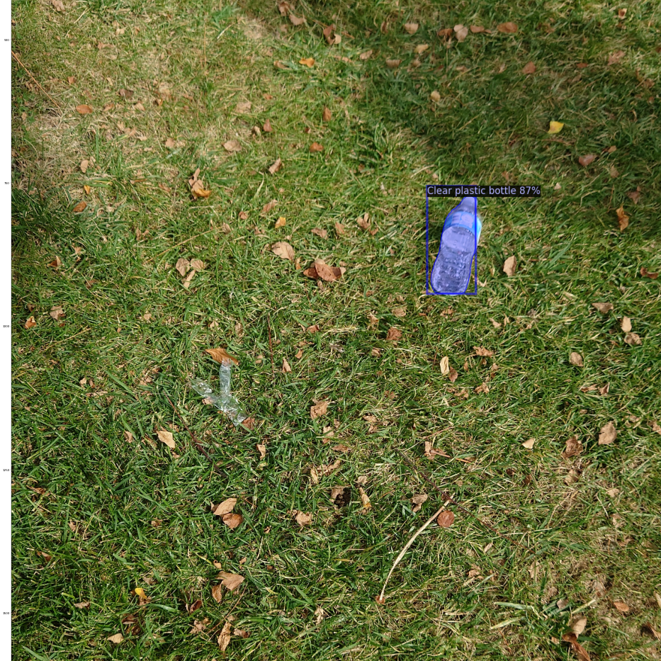
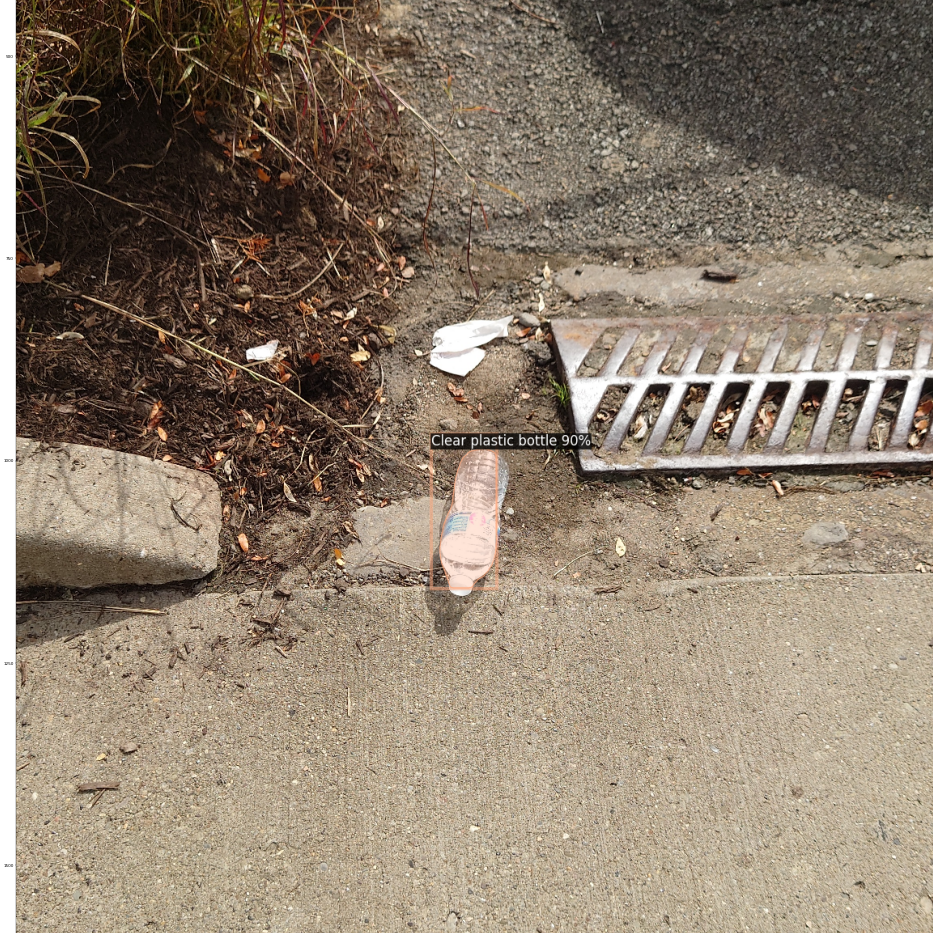

# HackCMU2021

## Preamble

This project has been coded in the scope of the HackCMU 2021: http://hackcmu.org/. The HackCMU is a 1 day beginnerfriendly hackthon organized by the Carnegie Mellon University in Pittsburgh. Our team won the Sustainability Hack Challenge by Bloomberg. The code in this repository is functional, however as the model has been build in only one day, our model is not well tuned and has been trained for only a really short time. Our model is able to detect some litter in images similar to the trainings data, but especially for unseen data and unseen trash objects, the results are not very good. We might improve the model in the future, but no timeframe is set for this yet. 

## The Project

    
    

 

Our team, Philip Neugebauer, Hong Sng, Tyler Wilson, and Allan Nguyen, trained a model to detect litter in images using [Detectron2](https://github.com/facebookresearch/detectron2) and the [TACO dataset](https://github.com/pedropro/TACO). Our script can then read out the GPS location of the image. It reads out the location of all images in which litter has been detected and the number of litter in the image, and prints it out. The text can then be read in and presented on our heatmap, to visualize areas in which a lot of litter has been detected. Code for the visualization can be found [here](https://github.com/snghong/heatmap).

## How we built it
- We used TACO, an open image dataset of waste in the wild. It contains photos of litter taken under diverse environments, from tropical beaches to London streets. These images are manually labeled and segmented according to a hierarchical taxonomy to train and evaluate object detection algorithms. 
- We then used Detectron 2, an Open-Source PyTorch-based object detection library. We employed its  pretrained region-based convolutional neural network and retrained the model using TACO dataset to detect litter.
- Once the model was trained to identify litter in images, we fed it with street images to understand the density of litter in various areas in Pittsburgh. Then, we extracted GPS data from the images and visualized the density of litter on a heat map. The heat map was built using Google Maps' JavaScript API and hosted on Netlify. 

## Install Instructions
- Install Detectron2 and all requirements of it. We used Python 3.7, Pytorch 1.9 and Cuda version 1.1. 
- Download the [TACO dataset](https://github.com/pedropro/TACO) 
- Run the script LitterDetection.ipynb to detect litter in images
